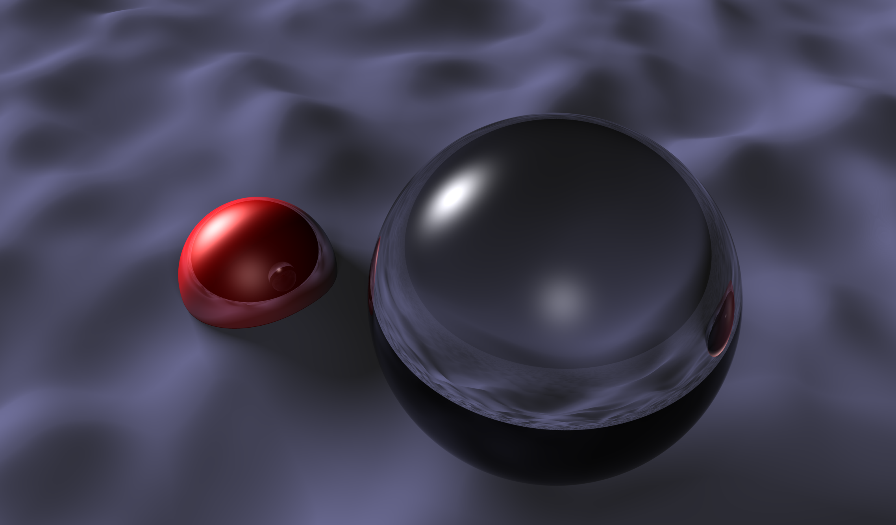
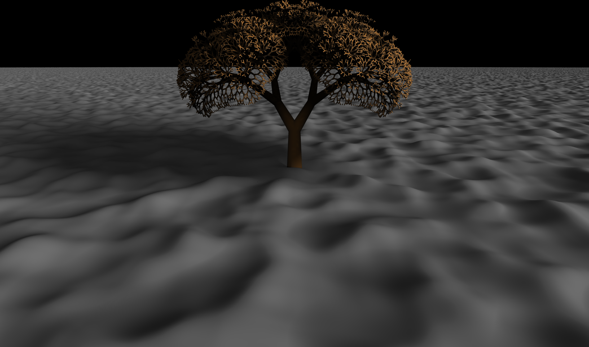
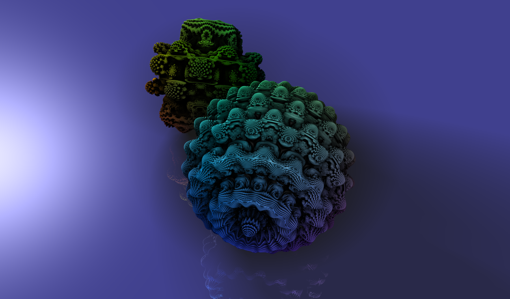
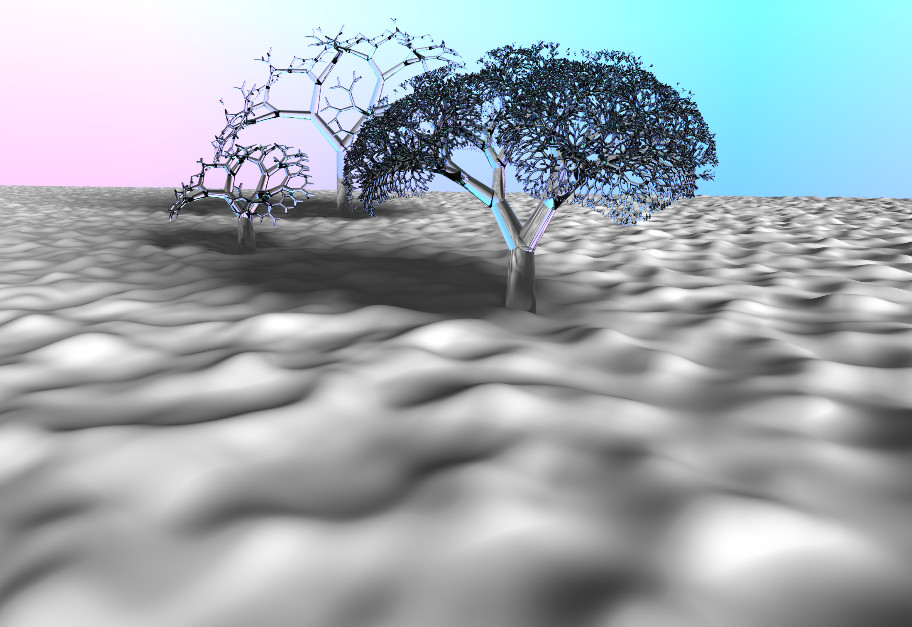
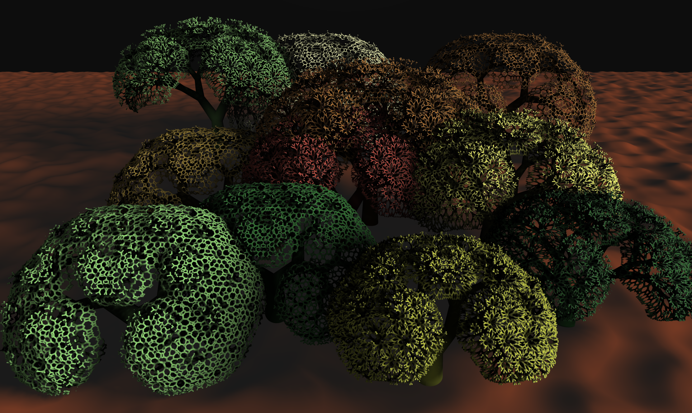

# CSCI1230 Final Project: Raymarching with Fractals

Team: No Preference

Members: Nathan Plano, Nick Huang, Richard Tang (rtang26)

In this project, we created a CPU Raymarching engine to render
interesting scenes like Mandelbulbs (3D fractals), fractal trees, and
procedurally generated terrains. The raymarcher supports:

-   Directional and spot lighting, according to the Phong BRDF
-   Soft shadows and partial occlusion
    -   This allows us to get ambient occlusion for free similar to path tracing
-   Supersampling
-   Reflection and Refraction
    -   Physically correct, according to the [Fresnel
        effect](https://www.researchgate.net/figure/Principle-of-the-Fresnel-effect-the-amount-of-reflection-on-a-reflective-surface-depends_fig3_319178578)
-   Interrupts
    -     A user defined interrupt service routine is invoked by the raymarcher after each intersection. This allows the user to modify any attribute of the intersected object on the fly before the illumination model is evaluated, e.g., perform position dependent coloring as shown by the mandelbulb examples.
-   Multithreading

Two fractal shapes, a Mandelbulb and a Fractal Tree, are also
implemented, with customizable fractal depth, height, and width.
Some scenes also have terrains; these are procedurally generated
using two octaves of Perlin noise, followed by a sigmoid smoothing.

Currently, the GUI supports toggling raymarcher supersampling and
multithreading, and all fractal parameters. Given time, we would like to
incorporate toggling of the other raymarching parameters; although they
are currently displayed on the UI, they have no effect.
-   Note on the UI: The `prototype-ui` folder contains the updated UI.
    Due to time constraints, we were unable to merge two separate
    development branches without compilation errors. The only difference
    between `prototype-ui` and `final` are the supported scenes.

Scenes are generated by combining multiple Distance Equations into one
Distance Field; the raymarcher utilizes this Distance Field for object
intersection. Currently, seven scenes are supported:

-   Sphere 
-   Fractal Tree 
-   Two Mandelbulbs 
-   Zoomed-in Mandelbulbs 
-   Glass Sphere with Mandelbulb 
-   Winter Wonderland 
-   Forest on Mars 
